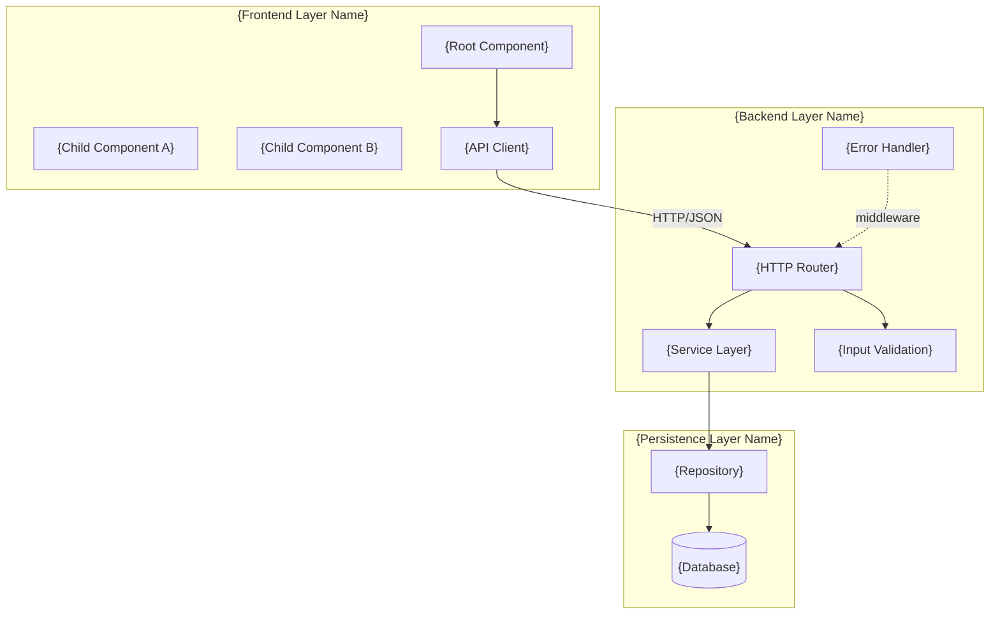
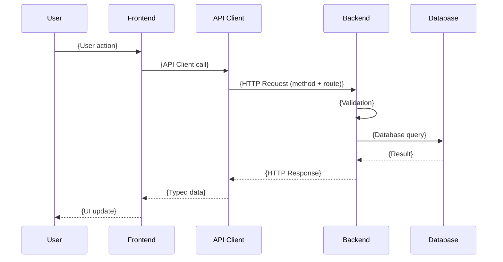

# Design Document

> **How to use this template:** Replace all text in `{curly braces}` and italic placeholders with your project's data.
> Sections marked `(Optional)` can be removed if they don't apply.
> This document derives from `requirements.md` — every design decision must be traceable to one or more requirements.

---

## Overview

<!--
  3–5 sentences covering:
  - What the system does (functional summary)
  - What the main architectural layers are
  - Which technologies/runtime are used
  - The design philosophy (e.g., simplicity, performance, extensibility)
-->

This document describes the technical design of {system/feature name}. The system is composed of {describe main layers, e.g., "three layers: a React frontend, a REST HTTP backend, and SQLite persistence"}.

{Describe the runtime and main tools.} {Describe the design philosophy — e.g., "eliminating external infrastructure dependencies and simplifying deployment."}

---

## Design Decisions

<!--
  One row per decision. Rationale in 1–2 sentences: "why this and not another."
  Cover: runtime, backend framework, frontend framework, database, ORM, styling,
  state management, communication, build tool, testing, authentication, deploy.
  See design-decisions-guide.md for the full category list.
-->

| Decision | Choice | Rationale |
|----------|--------|-----------|
| {Area} | {Technology/Approach} | {Why this — 1-2 sentences} |
| {Area} | {Technology/Approach} | {Why this — 1-2 sentences} |
| {Area} | {Technology/Approach} | {Why this — 1-2 sentences} |

---

## Architecture

<!--
  Describe the architectural pattern and each layer's role before the diagram.
  See system-architecture-guide.md for diagram rules and directory conventions.
-->

The system follows a **{pattern}** architecture with clear separation of concerns:

| Layer | Responsibility | Technology |
|-------|---------------|------------|
| Frontend | {responsibility} | {tech} |
| Backend | {responsibility} | {tech} |
| Persistence | {responsibility} | {tech} |

### Component Diagram



### Data Flow (Sequence Diagram)



### Directory Structure

```
{project}/
├── src/                    # Frontend
│   ├── api/                # API Client layer
│   ├── components/         # UI Components
│   ├── types.ts            # Shared TypeScript types
│   └── main.tsx
├── server/                 # Backend
│   ├── db/                 # Persistence layer
│   │   ├── init.ts
│   │   ├── seed.ts
│   │   └── {resource}Repository.ts
│   ├── routes/
│   │   └── {resource}.ts
│   ├── validation.ts
│   ├── errorHandler.ts
│   └── index.ts
└── package.json
```

---

## Components and Interfaces

<!--
  Order: root → leaf components, then API client, then backend endpoints,
  then server setup, then repositories.
  See components-and-interfaces-guide.md for rules and patterns.
-->

### Frontend — UI Components

#### 1. `{RootComponent}`

{Responsibility in 1–2 sentences.}

- **Internal state:** `{state}: {Type}`
- **Emits:** `{handler}({param})` when {user action}

#### 2. `{ChildComponent}`

{Responsibility in 1–2 sentences.}

- **Props:** `{prop1}: {Type}`, `{prop2}?: {Type}`, `{onAction}: ({param}: {Type}) => void`
- **Visual behaviors:** {conditional visual behavior}

<!-- Repeat for each component -->

### Frontend — API Client

```typescript
// src/api/{resource}Api.ts
const API_BASE = 'http://localhost:{port}';

export const {resource}Api = {
  getAll: (): Promise<{Type}[]> =>
    fetch(`${API_BASE}/{resource}`).then(handleResponse),

  getById: (id: number): Promise<{Type}> =>
    fetch(`${API_BASE}/{resource}/${id}`).then(handleResponse),

  create: (data: Create{Type}DTO): Promise<{Type}> =>
    fetch(`${API_BASE}/{resource}`, {
      method: 'POST',
      headers: { 'Content-Type': 'application/json' },
      body: JSON.stringify(data),
    }).then(handleResponse),

  update: (id: number, data: Update{Type}DTO): Promise<{Type}> =>
    fetch(`${API_BASE}/{resource}/${id}`, {
      method: 'PUT',
      headers: { 'Content-Type': 'application/json' },
      body: JSON.stringify(data),
    }).then(handleResponse),

  delete: (id: number): Promise<void> =>
    fetch(`${API_BASE}/{resource}/${id}`, { method: 'DELETE' }).then(handleResponse),
};
```

### Backend — REST Endpoints

| Method | Route | Description | Request Body | Response |
|--------|-------|-------------|--------------|----------|
| GET | `/api/{resource}` | List all | — | `{Type}[]` (200) |
| GET | `/api/{resource}/:id` | Get by ID | — | `{Type}` (200) |
| POST | `/api/{resource}` | Create | `Create{Type}DTO` | `{Type}` (201) |
| PUT | `/api/{resource}/:id` | Update | `Update{Type}DTO` | `{Type}` (200) |
| DELETE | `/api/{resource}/:id` | Delete | — | — (204) |

### Backend — Server Setup

```typescript
// server/index.ts
const db = new Database('{file}.sqlite', { create: true });
initializeDatabase(db);
seedDatabase(db);

serve({
  port: {port},
  routes: {
    '/api/{resource}': {
      GET: () => handler.getAll(db),
      POST: (req) => handler.create(db, req),
    },
    '/api/{resource}/:id': {
      GET: (req) => handler.getById(db, req),
      PUT: (req) => handler.update(db, req),
      DELETE: (req) => handler.delete(db, req),
    },
  },
  fetch(req) {
    return new Response('Not Found', { status: 404 });
  },
});
```

### Backend — Repository

```typescript
// server/db/{resource}Repository.ts
export class {Resource}Repository {
  constructor(private db: Database) {}

  findAll(): {Type}[] {
    return this.db.query('SELECT * FROM {table} ORDER BY created_at DESC').all() as {Type}[];
  }

  findById(id: number): {Type} | null {
    return this.db.query('SELECT * FROM {table} WHERE id = ?').get(id) as {Type} | null;
  }

  create(data: Create{Type}DTO): {Type} {
    return this.db.query(
      `INSERT INTO {table} ({fields}) VALUES ({placeholders}) RETURNING *`
    ).get(...values) as {Type};
  }

  update(id: number, data: Update{Type}DTO): {Type} | null {
    return this.db.query(
      `UPDATE {table} SET {field} = ? WHERE id = ? RETURNING *`
    ).get(data.field, id) as {Type} | null;
  }

  delete(id: number): boolean {
    return this.db.run('DELETE FROM {table} WHERE id = ?', [id]).changes > 0;
  }
}
```

### Error Handling

| Category | HTTP Status | Condition | Message |
|----------|-------------|-----------|---------|
| Validation | 400 | Missing required field or invalid format | "{field} is required" |
| Not Found | 404 | ID does not exist | "{Resource} not found" |
| Internal Error | 500 | Unhandled exception | "Internal server error" |

Error response format:
```json
{
  "error": "VALIDATION_ERROR",
  "message": "{Human-readable message}"
}
```

---

## Data Models

<!--
  Three layers: ER diagram → SQL schema → TypeScript types.
  See data-models-guide.md for cardinality syntax, SQL conventions, and DTO rules.
-->

### ER Diagram

```mermaid
erDiagram
    {ENTITY_1} {
        INTEGER id PK "autoincrement"
        TEXT {field1} "NOT NULL"
        TEXT {enum_field} "NOT NULL, CHECK(val1|val2|val3)"
        TEXT created_at "DEFAULT datetime('now')"
    }

    {ENTITY_2} {
        INTEGER id PK "autoincrement"
        INTEGER {fk_field} FK "NOT NULL, REFERENCES {entity1}(id) ON DELETE CASCADE"
        TEXT {field1} "NOT NULL"
        TEXT created_at "DEFAULT datetime('now')"
    }

    {ENTITY_1} ||--o{ {ENTITY_2} : "{relationship}"
```

### SQL Schema

```sql
CREATE TABLE IF NOT EXISTS {table} (
    id          INTEGER PRIMARY KEY AUTOINCREMENT,
    {field1}    TEXT    NOT NULL,
    {field2}    TEXT    DEFAULT '',
    {enum_field} TEXT   NOT NULL
                        CHECK({enum_field} IN ('{val1}', '{val2}', '{val3}'))
                        DEFAULT '{default_val}',
    created_at  TEXT    NOT NULL DEFAULT (datetime('now'))
);

CREATE TABLE IF NOT EXISTS {related_table} (
    id          INTEGER PRIMARY KEY AUTOINCREMENT,
    {fk_field}  INTEGER NOT NULL REFERENCES {table}(id) ON DELETE CASCADE,
    {field1}    TEXT    NOT NULL,
    created_at  TEXT    NOT NULL DEFAULT (datetime('now'))
);

PRAGMA foreign_keys = ON;
PRAGMA journal_mode = WAL;
```

### TypeScript Types

```typescript
// types.ts

type {StatusType} = '{val1}' | '{val2}' | '{val3}';
type {PriorityType} = 'High' | 'Medium' | 'Low';

interface {Entity} {
  id: number;
  {field1}: string;
  {enum_field}: {StatusType};
  {nullable_field}: string | null;
  created_at: string;
}

interface Create{Entity}DTO {
  {field1}: string;
  {field2}?: string;
  {enum_field}?: {StatusType};
}

interface Update{Entity}DTO {
  {field1}: string;
  {field2}?: string;
  {enum_field}?: {StatusType};
}

interface ApiError {
  error: string;
  message: string;
}
```

### JSON Serialization Mapping

| DB Field | JSON Field | JSON Type | Notes |
|----------|-----------|-----------|-------|
| `id` | `id` | `number` | Autoincrement |
| `{field1}` | `{field1}` | `string` | — |
| `{nullable_field}` | `{nullable_field}` | `string \| null` | null when not set |
| `created_at` | `created_at` | `string` | ISO 8601 |

---

## Testing Strategy

<!--
  Define how each layer of the system will be tested.
  Derived from the acceptance criteria in requirements.md.
  See complex system specs for examples across service and pipeline architectures.
-->

### Unit Testing
- **Scope:** Business logic, validation functions, data transformations, repository methods
- **Framework:** {e.g., Vitest, Jest}
- **Coverage target:** {e.g., 80% of core business logic}

### Integration Testing
- **Scope:** API endpoints with real database, external service interactions
- **Approach:** {e.g., test against a real SQLite instance, not mocks}
- **Key flows:** {list the 2–3 most critical integration paths}

### End-to-End Testing
- **Scope:** Complete user workflows from UI to database
- **Framework:** {e.g., Playwright, Cypress}
- **Key scenarios:** {list scenarios derived from acceptance criteria}

### Contract Testing (if microservices)
- **Scope:** API contracts between services
- **Approach:** {e.g., Pact, OpenAPI schema validation}

---

## Optional Sections

### Authentication and Authorization (Optional)

<!--
  Include if the system has access control.
  Document: auth mechanism (JWT, Session, OAuth), login/logout flow,
  token structure, authorization middleware, roles and permissions.
-->

### Cache and Performance (Optional)

<!--
  Include if there are caching strategies or optimizations.
  Document: cache strategy (in-memory, Redis, HTTP), TTL, cache invalidation,
  database indexes, pagination approach.
-->

### External Integrations (Optional)

<!--
  Include if the system integrates with external services.
  Document: service name and purpose, communication protocol, authentication
  with the service, failure handling (retry, circuit breaker, fallback).
-->

### Observability (Optional)

<!--
  Include for production systems.
  Document: logging format and levels, metrics collected, health check endpoints,
  alert conditions.
-->

---

## Traceability: Requirements → Design

<!--
  Map every requirement to the design components that implement it.
  See traceability-guide.md for format and coverage checklist.
-->

| Requirement | Design Components |
|-------------|------------------|
| Req {N}: {Title} | `{Component}`, {Method} `{route}`, `{Repository.method()}`, schema `{table}` |
| Req {N}: {Title} | `{Component}`, {Method} `{route}`, `{Repository.method()}` |
