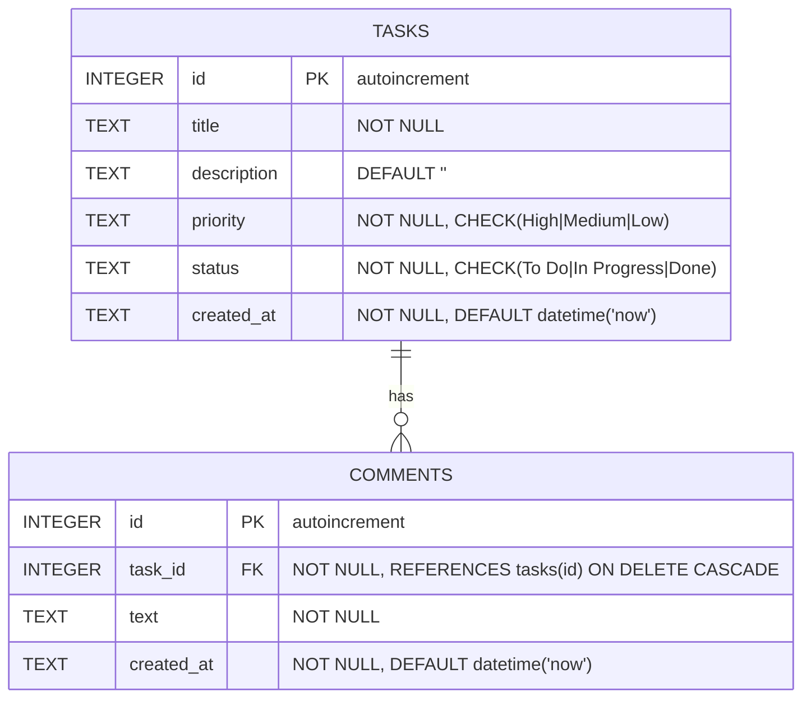

# Guide: Data Models

## Purpose

This section defines all data structures in four complementary layers:

1. **ER Diagram** — visual relationships between entities
2. **SQL Schema (DDL)** — database implementation with constraints
3. **TypeScript Types** — interfaces, union types, and DTOs used in code
4. **Serialization Mapping** — how data flows between the database and the API

Every entity must correspond to a term defined in the Requirements Glossary.

---

## General Rules

1. **Traceability:** Every entity must be justifiable by at least one requirement
2. **Consistency:** Entity names must be the same in the ER diagram, SQL schema, and TypeScript (or mapped explicitly)
3. **Enforce constraints at the database level:** validate enums, NOT NULL, and foreign keys in SQL — not only in code
4. **DTOs are separate from entities:** `CreateDTO` omits `id` and `created_at`; `UpdateDTO` makes all fields optional
5. **Always declare ON DELETE:** every `REFERENCES` must specify `ON DELETE CASCADE`, `SET NULL`, or `RESTRICT`

---

## Layer 1: ER Diagram (Mermaid)

**Cardinality notation:**
- `||--o{` — one to many (one mandatory, many optional)
- `||--|{` — one to many (both mandatory)
- `}o--o{` — many to many
- `||--||` — one to one

For each entity, include field type and constraint as a comment:

```mermaid
erDiagram
    {ENTITY_1} {
        INTEGER id PK "autoincrement"
        TEXT {field1} "NOT NULL"
        TEXT {enum_field} "NOT NULL, CHECK(val1|val2|val3)"
        TEXT created_at "DEFAULT datetime('now')"
    }

    {ENTITY_2} {
        INTEGER id PK "autoincrement"
        INTEGER {fk_field} FK "NOT NULL, REFERENCES {entity1}(id) ON DELETE CASCADE"
        TEXT {field1} "NOT NULL"
        TEXT created_at "DEFAULT datetime('now')"
    }

    {ENTITY_1} ||--o{ {ENTITY_2} : "{relationship label}"
```

**Worked example:**



---

## Layer 2: SQL Schema (DDL)

**Rules:**
- `CREATE TABLE IF NOT EXISTS` — idempotent
- `PRIMARY KEY AUTOINCREMENT` for all PKs
- `NOT NULL` explicit for required fields
- `CHECK(field IN ('v1', 'v2', 'v3'))` for enum fields
- `DEFAULT` for fields with a default value
- `REFERENCES {table}(id) ON DELETE CASCADE` for cascading foreign keys
- Enable `PRAGMA foreign_keys = ON` and `PRAGMA journal_mode = WAL`

```sql
-- {Description of main table}
CREATE TABLE IF NOT EXISTS {table} (
    id          INTEGER PRIMARY KEY AUTOINCREMENT,
    {field1}    TEXT    NOT NULL,
    {field2}    TEXT    DEFAULT '',
    {enum_field} TEXT   NOT NULL
                        CHECK({enum_field} IN ('{val1}', '{val2}', '{val3}'))
                        DEFAULT '{default_val}',
    created_at  TEXT    NOT NULL DEFAULT (datetime('now'))
);

-- {Description of dependent table}
CREATE TABLE IF NOT EXISTS {related_table} (
    id          INTEGER PRIMARY KEY AUTOINCREMENT,
    {fk_field}  INTEGER NOT NULL REFERENCES {table}(id) ON DELETE CASCADE,
    {field1}    TEXT    NOT NULL,
    created_at  TEXT    NOT NULL DEFAULT (datetime('now'))
);

PRAGMA foreign_keys = ON;
PRAGMA journal_mode = WAL;
```

---

## Layer 3: TypeScript Types

Organize in four groups, in this order:

```typescript
// types.ts

// === 1. Enums / Union Types ===
// Use union types instead of enum for better tree-shaking
type {StatusType} = 'To Do' | 'In Progress' | 'Done';
type {PriorityType} = 'High' | 'Medium' | 'Low';

// === 2. Database Entities ===
// Reflects exactly what comes from the database (snake_case field names)
interface {Entity} {
  id: number;
  {field1}: string;
  {enum_field}: {StatusType};
  {nullable_field}: string | null;
  created_at: string; // ISO 8601
}

// === 3. DTOs (Data Transfer Objects) ===
interface Create{Entity}DTO {
  {field1}: string;               // required
  {field2}?: string;              // optional — uses database default
  {enum_field}?: {StatusType};    // optional — uses database default
}

interface Update{Entity}DTO {
  {field1}: string;
  {field2}?: string;
  {enum_field}?: {StatusType};
}

// === 4. API Error Response ===
interface ApiError {
  error: string;   // machine code (e.g., VALIDATION_ERROR)
  message: string; // human-readable message
}
```

---

## Layer 4: JSON Serialization Mapping

Document how each database field maps to the API JSON response.

| DB Field | JSON Field | JSON Type | Notes |
|----------|-----------|-----------|-------|
| `id` | `id` | `number` | Autoincrement |
| `{text_field}` | `{text_field}` | `string` | — |
| `{nullable_field}` | `{nullable_field}` | `string \| null` | null when not set |
| `created_at` | `created_at` | `string` | ISO 8601 format |

**Serialization mechanism:** `Response.json(object)` serializes automatically. SQLite has no `Date` type — store as `TEXT` in ISO 8601. Dates retrieved from the DB are already strings and require no transformation.

**Round-trip guarantee:** serializing → deserializing must produce an equivalent object. Verify especially: `null` fields, date strings, and optional fields that use database defaults.

---

## Seed Data

```typescript
// server/db/seed.ts
export function seedDatabase(db: Database): void {
  const { count } = db.query(
    'SELECT COUNT(*) as count FROM {table}'
  ).get() as { count: number };

  if (count > 0) return; // Do not re-seed if data already exists

  // Insert {N} records distributed across all possible states
  // Goal: demonstrate every visual state when the app first opens
}
```

**Why seed data matters:**
- Lets you test the system visually immediately after setup
- Demonstrates all possible status/priority states
- Serves as living documentation of the data format

---

## Anti-patterns

| Anti-pattern | Problem |
|--------------|---------|
| TypeScript `enum` instead of union types | Worse tree-shaking and more complex serialization |
| No `CHECK` constraint in the DB for enum fields | Invalid values enter silently |
| CreateDTO with the same fields as the entity | Exposes internal fields (`id`, `created_at`) at creation time |
| No `ON DELETE` on foreign keys | Orphaned records after deletion |
| `Date` TypeScript type for date fields | SQLite has no Date type — use ISO 8601 string |
| Seed data without a `count > 0` guard | Duplicates data on every server restart |
