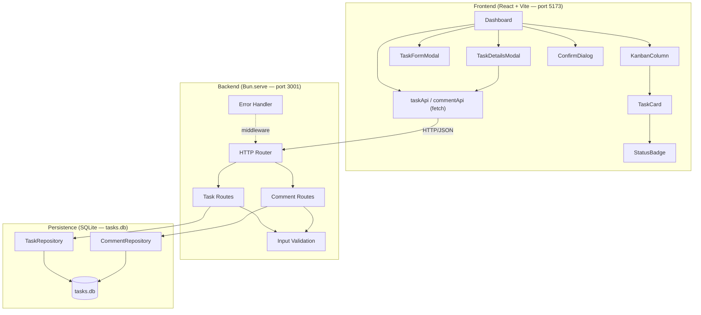
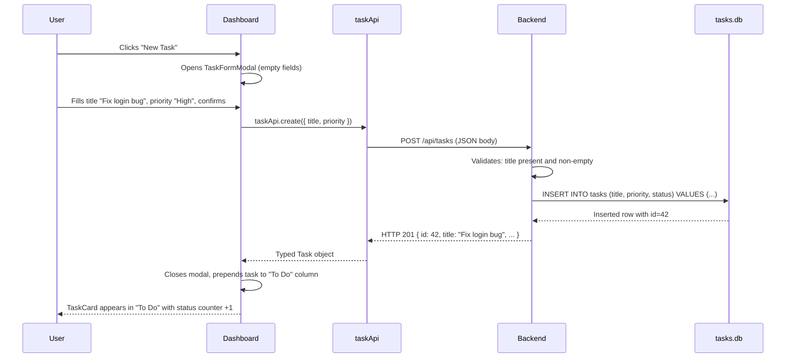
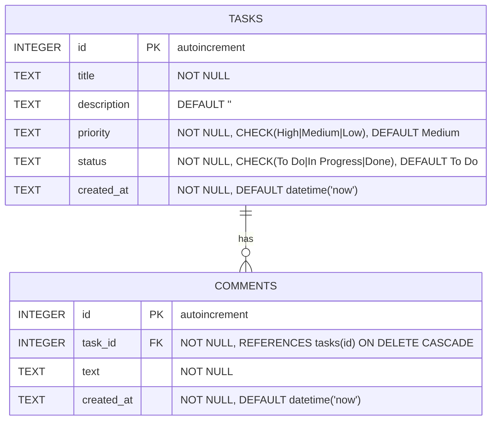
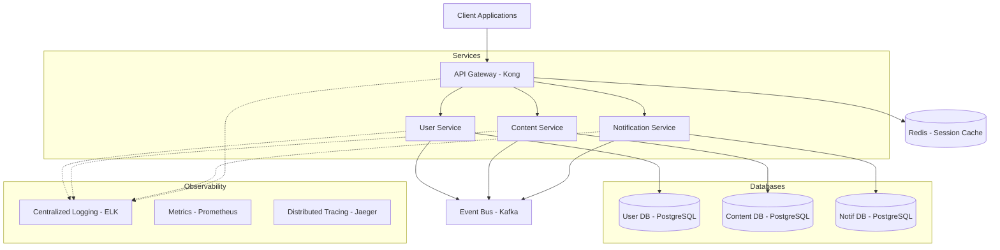
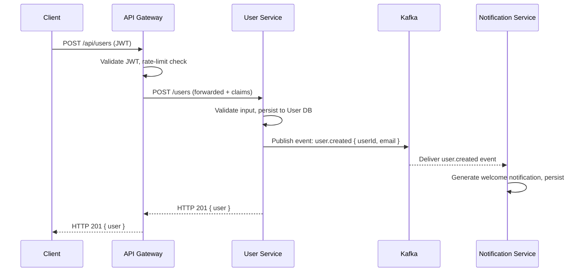
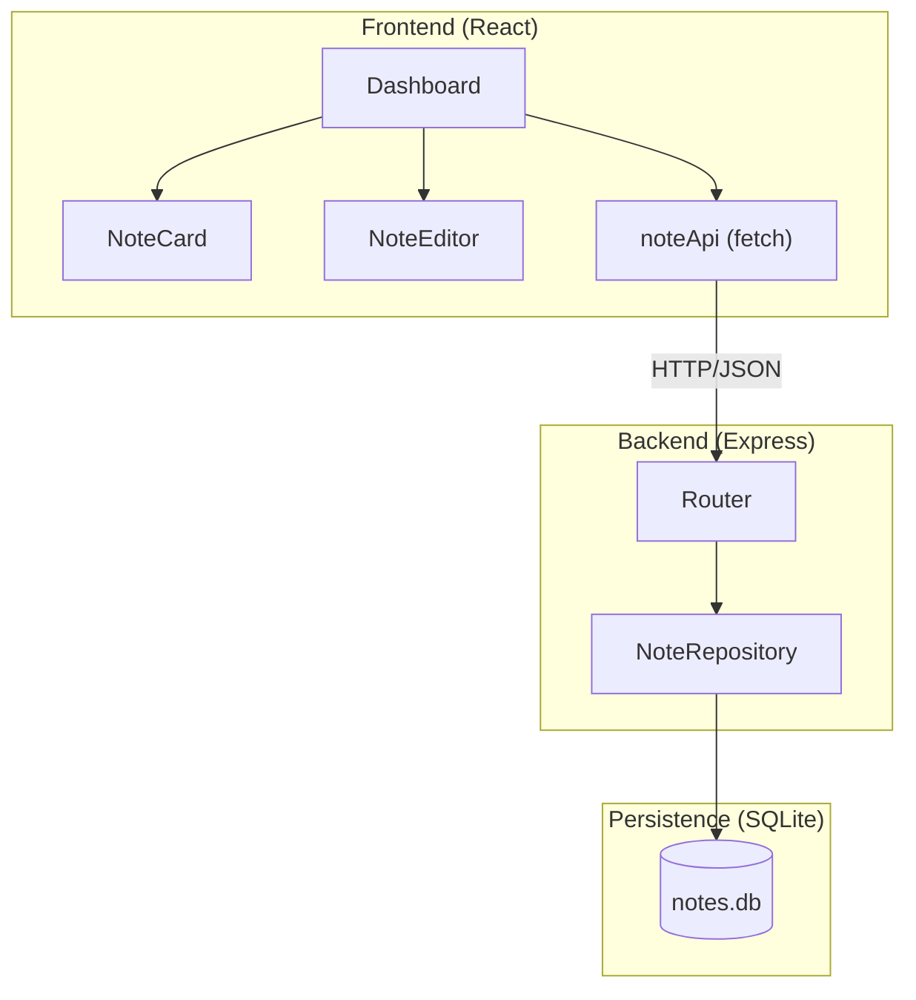
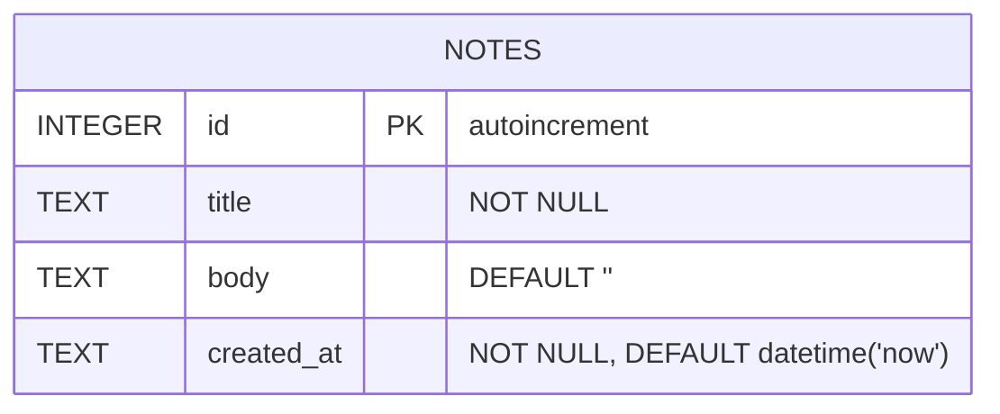

# Sample Design Guide

Complete, filled-in examples across all design sections. Use these as reference when producing a design document for a project. The examples below correspond to the Kanban task manager described in the requirements sample guide.

---

## Table of Contents

1. [Complete Worked Example: Kanban Task Manager](#complete-worked-example-kanban-task-manager)
   - [Design Decisions](#design-decisions)
   - [Architecture](#architecture)
   - [Components and Interfaces](#components-and-interfaces)
   - [Data Models](#data-models)
   - [Traceability: Requirements → Design](#traceability-requirements--design)
2. [Complex System Example: Multi-Service API](#complex-system-example-multi-service-api)
   - [Design Decisions](#design-decisions-1)
   - [Architecture](#architecture-1)
   - [Components and Interfaces](#components-and-interfaces-1)
   - [Error Handling](#error-handling)
   - [Testing Strategy](#testing-strategy)
   - [Traceability: Requirements → Design](#traceability-requirements--design-1)
3. [Minimal Complete Document (Reference)](#minimal-complete-document-reference)

---

## Complete Worked Example: Kanban Task Manager

**Context:** A task management board where users can create, view, edit, and delete tasks organized in three Kanban columns (To Do / In Progress / Done). Tasks have comments. The app is a fullstack TypeScript project using Bun + React.

---

### Design Decisions

| Decision | Choice | Rationale |
|----------|--------|-----------|
| Runtime | Bun | Single runtime for server, database, and package management. Native TypeScript and SQLite support without configuration. |
| HTTP Server | Bun.serve() with routes | High-performance native router. No external framework needed for this scale. |
| Database | bun:sqlite | Embedded SQLite, synchronous API, 3–6x faster than better-sqlite3. Zero infrastructure dependencies — a single file is the entire database. |
| Frontend | React 19 + Vite 8 | Mature SPA ecosystem with rich component libraries. Vite provides fast HMR with Bun. |
| Styling | CSS Modules | Component-scoped styles with no CSS-in-JS runtime cost. Works well with Vite's CSS pipeline. |
| State | React hooks (useState/useEffect) | Sufficient for the app's complexity. No external state library needed for a single-page CRUD app. |
| Communication | REST + JSON via fetch | Simple, well-supported, and adequate for CRUD operations. No over-engineering with GraphQL or tRPC. |
| Type System | TypeScript strict | Compile-time safety across frontend and backend. Types defined once in `types.ts` and imported by both layers. |

---

### Architecture

The system follows a **three-layer** architecture with clear separation of concerns:

| Layer | Responsibility | Technology |
|-------|---------------|------------|
| Frontend | User interface, local state, API calls | React 19 + Vite 8 |
| Backend | HTTP routing, input validation, business logic | Bun.serve() |
| Persistence | Storage, queries, referential integrity | bun:sqlite |

#### Component Diagram



#### Data Flow (Sequence Diagram)



#### Directory Structure

```
kanban-app/
├── src/                                # Frontend (React)
│   ├── api/
│   │   ├── taskApi.ts                  # CRUD functions for Task
│   │   ├── commentApi.ts               # CRUD functions for Comment
│   │   └── handleResponse.ts           # Generic HTTP error handler
│   ├── components/
│   │   ├── Dashboard/
│   │   │   ├── Dashboard.tsx
│   │   │   └── Dashboard.module.css
│   │   ├── KanbanColumn/
│   │   ├── TaskCard/
│   │   ├── StatusBadge/
│   │   ├── TaskFormModal/
│   │   ├── TaskDetailsModal/
│   │   └── ConfirmDialog/
│   ├── types.ts                        # Shared TypeScript types (frontend)
│   ├── App.tsx
│   └── main.tsx
├── server/
│   ├── db/
│   │   ├── init.ts                     # DDL schema (CREATE TABLE IF NOT EXISTS)
│   │   ├── seed.ts                     # Seed data (6 sample tasks)
│   │   ├── taskRepository.ts
│   │   └── commentRepository.ts
│   ├── routes/
│   │   ├── tasks.ts
│   │   └── comments.ts
│   ├── validation.ts
│   ├── errorHandler.ts
│   └── index.ts                        # Bun.serve() entry point
├── index.html
├── vite.config.ts                      # Proxy /api → port 3001
├── tsconfig.json
└── package.json
```

---

### Components and Interfaces

#### Frontend — UI Components

##### 1. `Dashboard`

Root component. Fetches all tasks on mount, manages the global task list, and orchestrates opening/closing of modals.

- **Internal state:** `tasks: Task[]`, `selectedTask: Task | null`, `isFormOpen: boolean`, `isDetailsOpen: boolean`, `taskToDelete: number | null`
- **Emits:** `handleCreate(dto)`, `handleUpdate(id, dto)`, `handleDelete(id)`, `handleStatusChange(id, status)`

##### 2. `KanbanColumn`

Displays one status column with its task cards and a header showing the status name and task count.

- **Props:** `status: TaskStatus`, `tasks: Task[]`, `onEdit: (task: Task) => void`, `onDelete: (id: number) => void`, `onViewDetails: (task: Task) => void`

##### 3. `TaskCard`

Renders a single task with title, priority badge, and action buttons.

- **Props:** `task: Task`, `onEdit: (task: Task) => void`, `onDelete: (id: number) => void`, `onClick: (task: Task) => void`
- **Visual behaviors:** Priority badge — `High` → red background, `Medium` → amber, `Low` → gray

##### 4. `StatusBadge`

Displays a colored pill for task status or priority.

- **Props:** `value: TaskStatus | TaskPriority`, `type: 'status' | 'priority'`

##### 5. `TaskFormModal`

Modal for creating or editing a task. Reuses the same form for both operations.

- **Props:** `task?: Task` (undefined = create mode), `onSubmit: (dto: CreateTaskDTO | UpdateTaskDTO) => void`, `onClose: () => void`
- **Internal state:** `title: string`, `description: string`, `priority: TaskPriority`, `errors: Record<string, string>`
- **Visual behaviors:** Submit button disabled while title is empty. Error message `"Title is required"` appears below title input on failed submit.

##### 6. `TaskDetailsModal`

Shows full task details and an inline comment thread. Fetches comments when opened.

- **Props:** `task: Task`, `onClose: () => void`
- **Internal state:** `comments: Comment[]`, `newComment: string`

##### 7. `ConfirmDialog`

Generic confirmation dialog for destructive actions.

- **Props:** `message: string`, `onConfirm: () => void`, `onCancel: () => void`

---

#### Frontend — API Client

```typescript
// src/api/taskApi.ts
const API_BASE = 'http://localhost:3001';

export const taskApi = {
  getAll: (): Promise<Task[]> =>
    fetch(`${API_BASE}/api/tasks`).then(handleResponse<Task[]>),

  create: (data: CreateTaskDTO): Promise<Task> =>
    fetch(`${API_BASE}/api/tasks`, {
      method: 'POST',
      headers: { 'Content-Type': 'application/json' },
      body: JSON.stringify(data),
    }).then(handleResponse<Task>),

  update: (id: number, data: UpdateTaskDTO): Promise<Task> =>
    fetch(`${API_BASE}/api/tasks/${id}`, {
      method: 'PUT',
      headers: { 'Content-Type': 'application/json' },
      body: JSON.stringify(data),
    }).then(handleResponse<Task>),

  delete: (id: number): Promise<void> =>
    fetch(`${API_BASE}/api/tasks/${id}`, { method: 'DELETE' }).then(handleResponse<void>),
};

// src/api/commentApi.ts
export const commentApi = {
  getByTask: (taskId: number): Promise<Comment[]> =>
    fetch(`${API_BASE}/api/tasks/${taskId}/comments`).then(handleResponse<Comment[]>),

  create: (taskId: number, data: CreateCommentDTO): Promise<Comment> =>
    fetch(`${API_BASE}/api/tasks/${taskId}/comments`, {
      method: 'POST',
      headers: { 'Content-Type': 'application/json' },
      body: JSON.stringify(data),
    }).then(handleResponse<Comment>),
};
```

---

#### Backend — REST Endpoints

| Method | Route | Description | Request Body | Response |
|--------|-------|-------------|--------------|----------|
| GET | `/api/tasks` | List all tasks | — | `Task[]` (200) |
| GET | `/api/tasks/:id` | Get task by ID | — | `Task` (200) |
| POST | `/api/tasks` | Create task | `CreateTaskDTO` | `Task` (201) |
| PUT | `/api/tasks/:id` | Update task | `UpdateTaskDTO` | `Task` (200) |
| DELETE | `/api/tasks/:id` | Delete task | — | — (204) |
| GET | `/api/tasks/:id/comments` | List task comments | — | `Comment[]` (200) |
| POST | `/api/tasks/:id/comments` | Add comment | `CreateCommentDTO` | `Comment` (201) |

---

#### Backend — Server Setup

```typescript
// server/index.ts
const db = new Database('tasks.db', { create: true });
initializeDatabase(db);
seedDatabase(db);

const taskRepo = new TaskRepository(db);
const commentRepo = new CommentRepository(db);

serve({
  port: 3001,
  routes: {
    '/api/tasks': {
      GET: () => taskRoutes.getAll(taskRepo),
      POST: (req) => taskRoutes.create(taskRepo, req),
    },
    '/api/tasks/:id': {
      GET: (req) => taskRoutes.getById(taskRepo, req),
      PUT: (req) => taskRoutes.update(taskRepo, req),
      DELETE: (req) => taskRoutes.delete(taskRepo, req),
    },
    '/api/tasks/:id/comments': {
      GET: (req) => commentRoutes.getByTask(commentRepo, req),
      POST: (req) => commentRoutes.create(commentRepo, req),
    },
  },
  fetch(req) {
    return new Response('Not Found', { status: 404 });
  },
});
```

---

#### Backend — Repositories

```typescript
// server/db/taskRepository.ts
export class TaskRepository {
  constructor(private db: Database) {}

  findAll(): Task[] {
    return this.db.query('SELECT * FROM tasks ORDER BY created_at DESC').all() as Task[];
  }

  findById(id: number): Task | null {
    return this.db.query('SELECT * FROM tasks WHERE id = ?').get(id) as Task | null;
  }

  create(data: CreateTaskDTO): Task {
    return this.db.query(
      `INSERT INTO tasks (title, description, priority, status)
       VALUES (?, ?, ?, 'To Do') RETURNING *`
    ).get(data.title, data.description ?? '', data.priority ?? 'Medium') as Task;
  }

  update(id: number, data: UpdateTaskDTO): Task | null {
    return this.db.query(
      `UPDATE tasks SET title = ?, description = ?, priority = ?, status = ?
       WHERE id = ? RETURNING *`
    ).get(data.title, data.description, data.priority, data.status, id) as Task | null;
  }

  delete(id: number): boolean {
    return this.db.run('DELETE FROM tasks WHERE id = ?', [id]).changes > 0;
  }
}
```

---

#### Error Handling

| Category | HTTP Status | Condition | Message |
|----------|-------------|-----------|---------|
| Validation | 400 | Missing `title` or empty string | `"title is required"` |
| Validation | 400 | Invalid `status` or `priority` value | `"invalid value for {field}"` |
| Not Found | 404 | Task or Comment ID not in DB | `"Task not found"` / `"Comment not found"` |
| Internal Error | 500 | Unhandled exception | `"Internal server error"` |

Error response format:
```json
{ "error": "Task not found" }
```

---

### Data Models

#### ER Diagram



#### SQL Schema

```sql
CREATE TABLE IF NOT EXISTS tasks (
    id          INTEGER PRIMARY KEY AUTOINCREMENT,
    title       TEXT    NOT NULL,
    description TEXT    DEFAULT '',
    priority    TEXT    NOT NULL
                        CHECK(priority IN ('High', 'Medium', 'Low'))
                        DEFAULT 'Medium',
    status      TEXT    NOT NULL
                        CHECK(status IN ('To Do', 'In Progress', 'Done'))
                        DEFAULT 'To Do',
    created_at  TEXT    NOT NULL DEFAULT (datetime('now'))
);

CREATE TABLE IF NOT EXISTS comments (
    id          INTEGER PRIMARY KEY AUTOINCREMENT,
    task_id     INTEGER NOT NULL REFERENCES tasks(id) ON DELETE CASCADE,
    text        TEXT    NOT NULL,
    created_at  TEXT    NOT NULL DEFAULT (datetime('now'))
);

PRAGMA foreign_keys = ON;
PRAGMA journal_mode = WAL;
```

#### TypeScript Types

```typescript
// types.ts

type TaskStatus   = 'To Do' | 'In Progress' | 'Done';
type TaskPriority = 'High'  | 'Medium'      | 'Low';

interface Task {
  id:          number;
  title:       string;
  description: string;
  priority:    TaskPriority;
  status:      TaskStatus;
  created_at:  string; // ISO 8601
}

interface Comment {
  id:         number;
  task_id:    number;
  text:       string;
  created_at: string;
}

interface CreateTaskDTO {
  title:        string;
  description?: string;
  priority?:    TaskPriority;
}

interface UpdateTaskDTO {
  title:       string;
  description: string;
  priority:    TaskPriority;
  status:      TaskStatus;
}

interface CreateCommentDTO {
  text: string;
}

interface ApiError {
  error: string;
}
```

#### JSON Serialization Mapping

| DB Field | JSON Field | JSON Type | Notes |
|----------|-----------|-----------|-------|
| `id` | `id` | `number` | Autoincrement |
| `title` | `title` | `string` | — |
| `description` | `description` | `string` | Empty string `""` when not provided |
| `priority` | `priority` | `string` | One of `High`, `Medium`, `Low` |
| `status` | `status` | `string` | One of `To Do`, `In Progress`, `Done` |
| `created_at` | `created_at` | `string` | ISO 8601 — stored and returned as TEXT |

`Response.json()` serializes rows directly. No date transformation needed — SQLite stores `datetime('now')` as text in ISO 8601 format. Round-trip is guaranteed as long as no field is a native `Date` object.

---

### Traceability: Requirements → Design

| Requirement | Design Components |
|-------------|------------------|
| Req 1: Kanban Dashboard Layout | `Dashboard`, `KanbanColumn`, `StatusBadge`, GET `/api/tasks`, `TaskRepository.findAll()` |
| Req 2: Task Creation | `TaskFormModal` (create mode), POST `/api/tasks`, `TaskRepository.create()`, schema `tasks` |
| Req 3: Task Status Update | `TaskFormModal` (edit mode), PUT `/api/tasks/:id`, `TaskRepository.update()` |
| Req 4: Task REST API | All endpoints, `TaskRoutes`, `ErrorHandler`, `Validation` |
| Req 5: Data Serialization Correctness | `types.ts` DTOs, `handleResponse()`, serialization mapping table, `PRAGMA foreign_keys` |
| Req 6: Keyboard Navigation | `ConfirmDialog`, semantic HTML in all components (implicit — no dedicated backend component) |

---

---

## Complex System Example: Multi-Service API

**Context:** A scalable API platform with User, Content, and Notification services behind an API Gateway, communicating via an Event Bus. Demonstrates the microservices pattern, event-driven communication, and the Observability subgraph — patterns from `complex-system-spec.md`.

---

### Design Decisions

| Decision | Choice | Rationale |
|----------|--------|-----------|
| Architectural Pattern | Microservices | Each service scales independently. Teams own and deploy services separately. Fault isolation: Notification outage doesn't affect User or Content. |
| API Entry Point | API Gateway (Kong) | Single entry point for auth, rate limiting, and CORS. Hides internal service topology from clients. |
| Inter-Service Communication | Event Bus (Kafka) | Loose coupling between services. Async processing handles load spikes. Events provide an audit trail and can be replayed. |
| Database Strategy | One DB per service (PostgreSQL) | Services own their data. No cross-service joins. Schema changes don't break other services. |
| Auth | JWT validated at Gateway | Stateless, scalable. Gateway validates once; services trust the forwarded claims. |
| Observability | Centralized logging + distributed tracing | Debugging across service boundaries requires correlation IDs and trace propagation. |
| Deploy | Kubernetes + Docker | Horizontal scaling per service, health checks, rolling deployments. |

---

### Architecture

#### Component Diagram



#### Event Flow (Sequence Diagram)



---

### Components and Interfaces

#### API Gateway Responsibilities
- JWT validation on all protected routes
- Rate limiting (per IP and per user)
- Request routing to downstream services
- SSL termination and CORS headers
- Correlation ID injection (`X-Correlation-ID` header)

#### Service Interfaces

```typescript
// Shared across services (shared-libs/types.ts)

interface DomainEvent {
  id: string;
  type: string;          // e.g., 'user.created', 'content.published'
  aggregateId: string;
  payload: Record<string, unknown>;
  timestamp: string;     // ISO 8601
  version: number;
}

interface UserService {
  createUser(data: CreateUserRequest): Promise<User>;
  getUserById(id: string): Promise<User>;
  updateUser(id: string, updates: UpdateUserRequest): Promise<User>;
  deleteUser(id: string): Promise<void>;
}

interface NotificationService {
  getNotificationsForUser(userId: string): Promise<Notification[]>;
  markAsRead(id: string): Promise<void>;
  subscribeToRealTime(userId: string): Promise<WebSocketConnection>;
}
```

#### Endpoints (User Service)

| Method | Route | Description | Request Body | Response |
|--------|-------|-------------|--------------|----------|
| POST | `/api/users` | Create user | `CreateUserRequest` | `User` (201) |
| GET | `/api/users/:id` | Get user | — | `User` (200) |
| PUT | `/api/users/:id` | Update user | `UpdateUserRequest` | `User` (200) |
| DELETE | `/api/users/:id` | Delete user | — | — (204) |

---

### Error Handling

| Strategy | Implementation |
|----------|----------------|
| Circuit Breaker | If a downstream service fails 5× in 10s, open the circuit and return a cached or degraded response |
| Retry with backoff | Transient failures retry up to 3× with exponential backoff (100ms → 200ms → 400ms) |
| Dead Letter Queue | Events that fail processing 3× go to a DLQ for manual review |
| Graceful degradation | Notification Service outage does not prevent User or Content operations |

---

### Testing Strategy

- **Unit tests:** Business logic per service (validation, domain rules)
- **Integration tests:** Each service against its own real DB (not mocked)
- **Contract tests:** Pact between services — consumer-driven API contracts
- **End-to-end:** Full user workflow via API Gateway with all services running
- **Chaos tests:** Kill one service; verify others continue with degraded functionality

---

### Traceability: Requirements → Design

| Requirement | Design Components |
|-------------|------------------|
| Req 1: Distributed architecture | Microservices pattern, API Gateway, Kubernetes |
| Req 2: Data consistency across services | Kafka Event Bus, DomainEvent interface, DLQ for failures |
| Req 3: Unified API access | API Gateway (single entry point), JWT auth, rate limiting |
| Req 4: Monitoring and observability | ELK logging, Prometheus metrics, Jaeger tracing, Correlation IDs |

---

## Minimal Complete Document (Reference)

The example below is a shorter design for a Personal Notes app — matching the minimal requirements document from the requirements sample guide.

```markdown
# Design Document — Personal Notes App

## Design Decisions

| Decision | Choice | Rationale |
|----------|--------|-----------|
| Runtime | Node.js 20 | Team familiarity. Stable LTS with broad library support. |
| Backend | Express.js | Minimal setup for a simple REST API. No need for a heavier framework. |
| Database | SQLite (better-sqlite3) | Zero-config, file-based, synchronous API — sufficient for personal use scale. |
| Frontend | React + Vite | Standard SPA setup; team already uses it in other projects. |
| Communication | REST + JSON | Simple and well-understood for CRUD. |

## Architecture



## Endpoints

| Method | Route | Request Body | Response |
|--------|-------|--------------|----------|
| GET | `/api/notes` | — | `Note[]` (200) |
| POST | `/api/notes` | `CreateNoteDTO` | `Note` (201) |
| PUT | `/api/notes/:id` | `UpdateNoteDTO` | `Note` (200) |
| DELETE | `/api/notes/:id` | — | — (204) |

## Data Models



```sql
CREATE TABLE IF NOT EXISTS notes (
    id         INTEGER PRIMARY KEY AUTOINCREMENT,
    title      TEXT NOT NULL,
    body       TEXT DEFAULT '',
    created_at TEXT NOT NULL DEFAULT (datetime('now'))
);
PRAGMA foreign_keys = ON;
```

```typescript
interface Note { id: number; title: string; body: string; created_at: string; }
interface CreateNoteDTO { title: string; body?: string; }
interface UpdateNoteDTO { title: string; body: string; }
```

## Traceability

| Requirement | Design Components |
|-------------|------------------|
| Req 1: Note List Display | `Dashboard`, `NoteCard`, GET `/api/notes`, `NoteRepository.findAll()` |
| Req 2: Note Creation | `NoteEditor`, POST `/api/notes`, `NoteRepository.create()`, schema `notes` |
```
