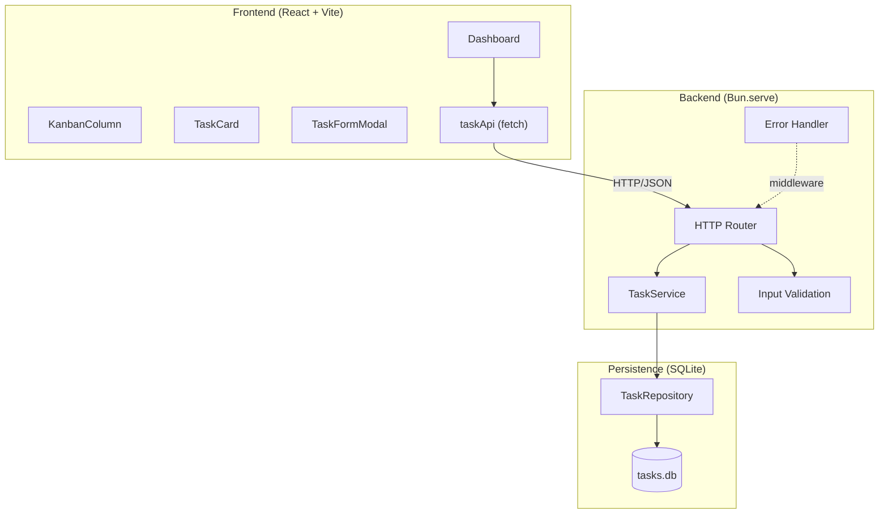
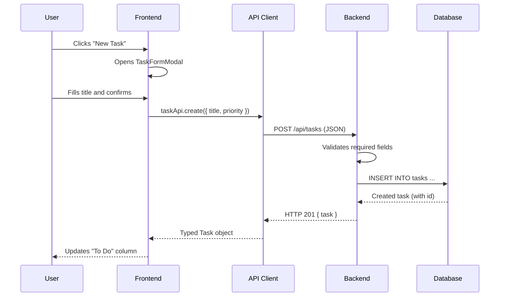
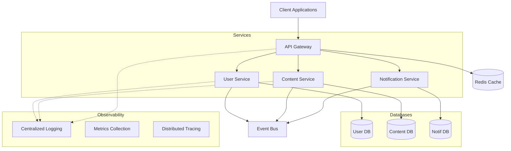
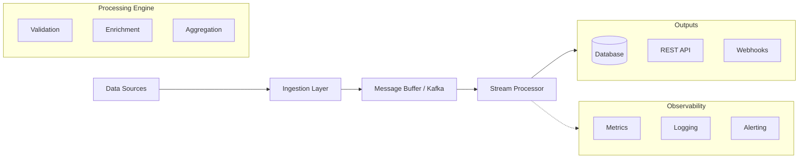

# Guide: System Architecture

## Purpose

The architecture section communicates the high-level design: what layers exist, how they communicate, and what a complete operation looks like from end to end. It is the primary shared reference for the entire team during implementation.

---

## Rules

1. **At least one Mermaid component diagram is mandatory** — `graph TB` or `graph LR`
2. **Include a sequence diagram** for the most representative operation in the system
3. **Group components by layer** using `subgraph`
4. **Document the directory structure** grouped by layer
5. **Describe each layer's role in text** before showing diagrams
6. **Name components descriptively** — avoid generic names like `Service`, `Handler`, `Component1`

---

## Section 1: Architectural Pattern

Declare the pattern and describe each layer's responsibilities:

```markdown
The system follows a **{pattern}** architecture with clear separation of concerns:

| Layer | Responsibility | Technology |
|-------|---------------|------------|
| Frontend | User interface, local state, API calls | React + Vite |
| Backend | HTTP routing, validation, business logic | Bun.serve() |
| Persistence | Storage, queries, referential integrity | bun:sqlite |
```

---

## Section 2: Component Diagram

**Diagram type:** `graph TB` (top-to-bottom) for layered architectures; `graph LR` (left-to-right) for linear pipelines.

**Diagram rules:**
- Use `subgraph` for each layer (Frontend, Backend, Database)
- Use `-->` for data flow
- Use `-.->` for secondary flows (middleware, logging, cache)
- Label arrows when the protocol matters: `-->|"HTTP/JSON"|`
- Include external services if any



---

## Section 3: Sequence Diagram

Show the complete flow of a representative operation (create, list, or update a resource).

**Rules:**
- Include the User as the first participant
- Show each layer as a separate participant
- Include validation and error handling in the flow
- Annotate key operations (validation, queries, state updates)



---

## Section 4: Directory Structure

Document the actual project structure grouped by layer. Annotate each directory's purpose.

```
{project}/
├── src/                          # Frontend (React)
│   ├── api/                      # API Client — backend communication layer
│   │   ├── {resource}Api.ts      # CRUD functions for {resource}
│   │   └── handleResponse.ts     # Generic HTTP response handler
│   ├── components/               # UI Components (one folder per component)
│   │   ├── {RootComponent}/      # Orchestrates state and modals
│   │   └── {ChildComponent}/     # Presentational components
│   ├── types.ts                  # Shared TypeScript types (frontend)
│   └── main.tsx                  # React entry point
├── server/                       # Backend (Bun)
│   ├── db/                       # Persistence layer
│   │   ├── init.ts               # DDL schema initialization
│   │   ├── seed.ts               # Seed data for development
│   │   └── {resource}Repository.ts
│   ├── routes/                   # HTTP route handlers
│   │   └── {resource}.ts
│   ├── validation.ts             # Input validation logic
│   ├── errorHandler.ts           # Standardized error responses
│   └── index.ts                  # Server entry point
└── package.json
```

---

## Complex System Patterns

### API Gateway + Microservices

For distributed systems, use `subgraph` for each service domain and show the event bus as a shared node:



**Key rules for microservices diagrams:**
- Each service owns its database — no cross-service DB arrows
- Event Bus is a shared infrastructure node, not a service
- Group Observability in its own subgraph (logging, metrics, tracing)
- API Gateway is the single entry point — all external arrows go through it

---

### Event-Driven / Data Pipeline (`graph LR`)

For pipelines, use left-to-right layout and show processing stages as a chain:



**Key rules for pipeline diagrams:**
- Always `graph LR` — data flows left to right
- Show the buffer (Kafka, SQS, RabbitMQ) explicitly between ingestion and processing
- Group output destinations in a subgraph
- Observability connects via `-.->` (secondary, not data flow)

---

## Diagram Types by Context

| Situation | Diagram Type | When to Use |
|-----------|-------------|-------------|
| Layered architecture | `graph TB` | Frontend → Backend → DB |
| Data pipeline | `graph LR` | Ingestion → Processing → Output |
| Operation flow | `sequenceDiagram` | Resource creation with validation |
| Entity relationships | `erDiagram` | Data models (Step 5) |
| State machine | `stateDiagram-v2` | Resource lifecycle (e.g., task status) |
| Decision logic | `flowchart` | Validation or routing logic |

---

## Anti-patterns

| Anti-pattern | Problem |
|--------------|---------|
| No `subgraph` per layer | Flat diagram is hard to read at a glance |
| Unlabeled arrows in multi-protocol systems | Ambiguous how components communicate |
| Sequence diagram with only the happy path | Doesn't document error handling behavior |
| Generic names: `Service`, `Handler` | Don't communicate responsibility |
| Missing directory structure | Team doesn't know where to create files |
