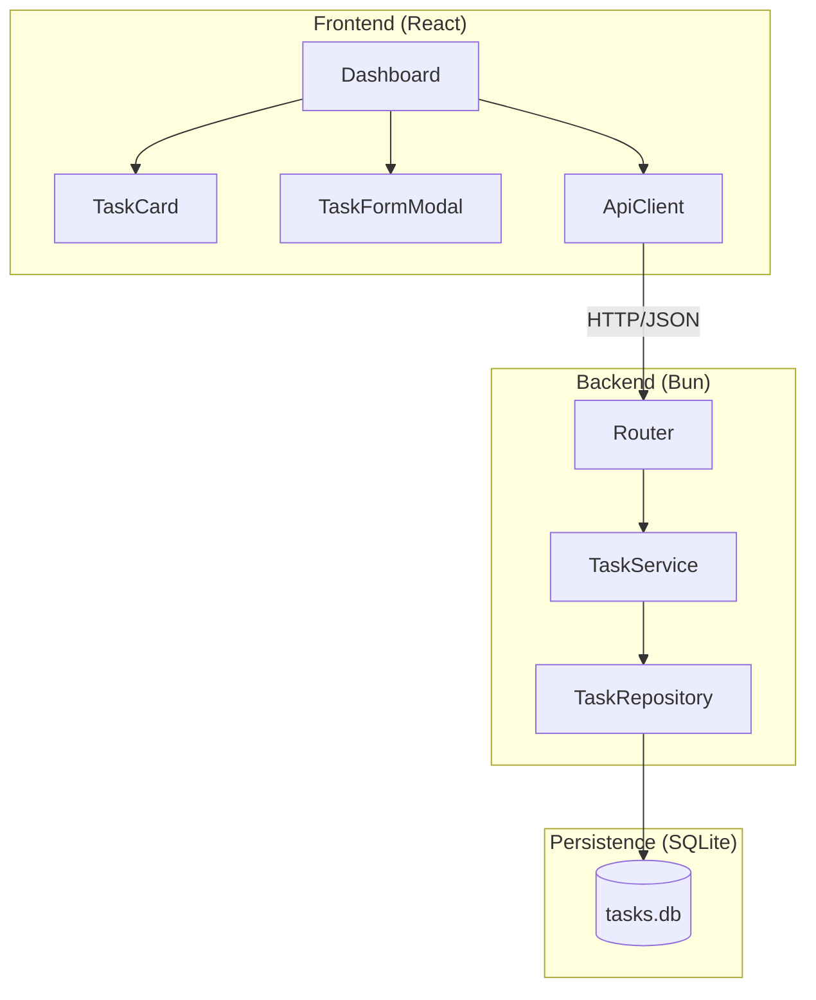
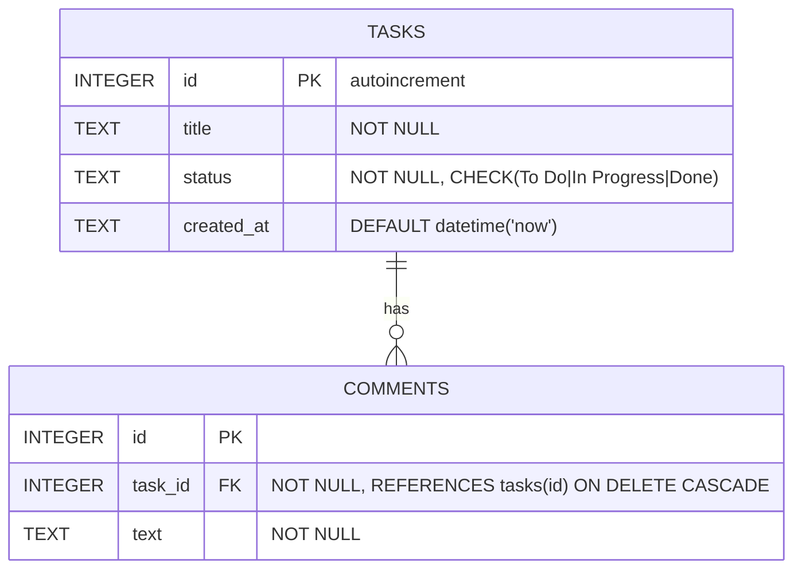

# Design Engineering

Transform approved requirements into a structured, implementation-ready technical design. This skill produces a complete design document covering architecture decisions, system layers, component interfaces, data models, API contracts, and full traceability back to requirements.

## When to Use This Skill

- After requirements are approved (use `requirements-engineering` first)
- Starting the technical design phase of any feature or system
- Creating a shared technical reference before implementation begins
- Aligning the team on architecture, data model, and API contracts before coding
- Translating EARS acceptance criteria into implementable technical blueprints

---

## 6-Step Workflow

### Step 1: Analyze Requirements and Map Design Scope

Review the approved requirements document. Identify: domain entities, system behaviors, integration points, and constraints (performance, security, scalability). List every Glossary term that will become a data model, component, or endpoint. Do not begin designing until you understand each requirement's implications.

→ See [traceability-guide.md](references/traceability-guide.md) for how to build the requirement → design mapping before you start.

### Step 2: Document Architecture Decisions (ADR)

For every significant technology choice — runtime, framework, database, communication protocol — record the decision and its justification in a compact ADR table. Cover all relevant categories. Write the justification in 1–2 sentences: "why this and not another." Document decisions before drawing any diagram.

→ See [design-decisions-guide.md](references/design-decisions-guide.md) for decision categories, rules, and a worked example.

### Step 3: Create System Architecture

Define the layered architecture with a Mermaid component diagram showing all major parts and their connections. Add a sequence diagram for the most representative operation. Document the project directory structure grouped by layer.

→ See [system-architecture-guide.md](references/system-architecture-guide.md) for diagram types, layering rules, and directory conventions.

### Step 4: Define Components and Interfaces

For each major component (UI components, API client, backend routes, service layer, repositories), document: purpose, responsibilities, TypeScript interface/props, and dependencies. Present REST endpoints in a table. Document error handling conventions.

→ See [components-and-interfaces-guide.md](references/components-and-interfaces-guide.md) for component documentation rules, endpoint table format, and error handling patterns.

### Step 5: Design Data Models

Define all data structures in four layers: (1) Mermaid ER diagram with cardinality and constraints, (2) SQL schema (DDL) with CHECK constraints and defaults, (3) TypeScript interfaces and DTOs, (4) JSON serialization mapping table. Add seed data logic.

→ See [data-models-guide.md](references/data-models-guide.md) for ER syntax, SQL conventions, DTO patterns, and serialization rules.

### Step 6: Validate and Deliver

Build the traceability matrix mapping every requirement to the design elements that implement it. Run the coverage checklist: every requirement is addressed, every domain term has a type, every endpoint has error responses, no design element exists without a corresponding requirement. Present for review and iterate until approved.

→ See [traceability-guide.md](references/traceability-guide.md) for the traceability matrix format and coverage checklist.
→ See [checklist_guide.md](references/checklist_guide.md) for the complete Design Phase Checklist (architecture, non-functional design, documentation, and review gates).

---

## Checklist

Before delivering, run the checklist in [checklist_guide.md](references/checklist_guide.md).

### Quick Reference
- [ ] Architecture overview with Mermaid component diagram
- [ ] ADR table with rationale for every major technology choice
- [ ] REST endpoint table (method, route, request body, response, HTTP codes)
- [ ] Data models: ER diagram, SQL DDL, TypeScript interfaces, JSON mapping
- [ ] Every requirement is addressed; traceability matrix is complete
- [ ] Every Glossary term has a corresponding type, component, or table
- [ ] Technical team has reviewed and approved

---

## Quick Example

```markdown
## Design Decisions

| Decision | Choice | Rationale |
|----------|--------|-----------|
| Runtime | Bun | Single runtime for server, DB, and packages. Native TypeScript and SQLite support. |
| Database | bun:sqlite | Embedded, synchronous API, zero infrastructure dependencies. |
| Frontend | React + Vite | Mature SPA ecosystem; fast HMR with Bun. |
| Communication | REST + JSON | Simple and well-supported, suitable for CRUD. |

## Architecture



## Endpoints

| Method | Route | Request Body | Response |
|--------|-------|--------------|----------|
| GET | `/api/tasks` | — | `Task[]` (200) |
| POST | `/api/tasks` | `CreateTaskDTO` | `Task` (201) |
| PUT | `/api/tasks/:id` | `UpdateTaskDTO` | `Task` (200) |
| DELETE | `/api/tasks/:id` | — | — (204) |

## Data Models



## Traceability

| Requirement | Design Components |
|-------------|------------------|
| Req 1: List tasks | `Dashboard`, `KanbanColumn`, GET `/api/tasks`, `TaskRepository.findAll()` |
| Req 2: Create task | `TaskFormModal`, POST `/api/tasks`, `TaskRepository.create()`, schema `tasks` |
```

---

## Output

Use the blank template at [assets/design-template.md](assets/design-template.md) as the starting point for a new design document.

For complete filled-in examples (Kanban task manager, minimal notes app), see [sample-design-guide.md](references/sample-design-guide.md).

---

## Output Locations

### Primary file (all tools)

Always generate the design document at:

```
<workspace-root>/docs/specs/{feature-name}/design.md
```

### Secondary file (tool-specific)

After generating the primary file, generate **one** secondary file for the active tool only. The secondary file must **reference** the primary — it is not a copy.

#### How to determine the active tool

1. **Detect automatically** — check for tool-specific directories in the workspace root:
   - `.kiro/` present → **Kiro**
   - `.github/` present → **GitHub Copilot**
   - `.agents/` present → **Google Antigravity**
   - `.claude/` present → **Claude**
2. **Multiple matches or none found** — ask the user: _"Which tool are you using? (Kiro / GitHub Copilot / Google Antigravity / Claude)"_
3. **User already stated the tool** in the request — use that, skip detection.

Generate the secondary file **only for the detected/chosen tool**. Do not create folders or files for the others.

| Tool | Secondary file path | Content |
|------|---------------------|---------|
| **Kiro** | `<workspace-root>/.kiro/specs/{feature-name}/design.md` | Brief prompt that instructs Kiro to use `docs/specs/{feature-name}/design.md` |
| **GitHub Copilot** | `<workspace-root>/.github/prompts/prompt-design-{feature-name}.md` | Brief prompt that instructs Copilot to use `docs/specs/{feature-name}/design.md` |
| **Google Antigravity** | `<workspace-root>/.agents/prompts/prompt-design-{feature-name}.md` | Brief prompt that instructs Antigravity to use `docs/specs/{feature-name}/design.md` |
| **Claude** | `<workspace-root>/.claude/prompts/prompt-design-{feature-name}.md` | Brief prompt that instructs Claude to use `docs/specs/{feature-name}/design.md` |

#### Kiro — `.kiro/specs/{feature-name}/design.md` format

```markdown
# Prompt: Design for {Feature Name}

Use the design document located at:
`docs/specs/{feature-name}/design.md`

When implementing or reviewing code related to **{Feature Name}**, load that file for the
full Architecture Decisions, Component Interfaces, Data Models, and API contracts before suggesting any changes.
```

#### GitHub Copilot — prompt file format

```markdown
# Prompt: Design for {Feature Name}

Use the design document located at:
`docs/specs/{feature-name}/design.md`

When implementing or reviewing code related to **{Feature Name}**, load that file for the
full Architecture Decisions, Component Interfaces, Data Models, and API contracts before suggesting any changes.
```

#### Google Antigravity — prompt file format

```markdown
# Prompt: Design for {Feature Name}

Use the design document located at:
`docs/specs/{feature-name}/design.md`

When implementing or reviewing code related to **{Feature Name}**, load that file for the
full Architecture Decisions, Component Interfaces, Data Models, and API contracts before suggesting any changes.
```

#### Claude — prompt file format

```markdown
# Prompt: Design for {Feature Name}

Use the design document located at:
`docs/specs/{feature-name}/design.md`

When implementing or reviewing code related to **{Feature Name}**, load that file for the
full Architecture Decisions, Component Interfaces, Data Models, and API contracts before suggesting any changes.
```
